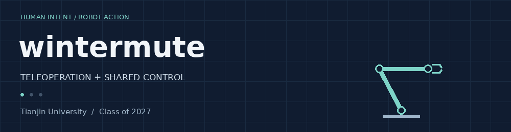

  

  <strong>Hi there, I'm wintermute 👋</strong> 
  Teleoperation &nbsp;·&nbsp; Shared Control &nbsp;·&nbsp; Robot Learning Data

  <a href="https://www.tju.edu.cn/">
    <picture>
      <source media="(prefers-color-scheme: dark)" srcset="assets/tianjin-university.png" />
      
    </picture>
  </a>

  <a href="mailto:13364149979@163.com">Email</a> &nbsp;/&nbsp;
  <a href="https://github.com/wintermute1895?tab=repositories">Repositories</a> &nbsp;/&nbsp;
  <a href="#selected-work">Selected work</a>

---

### From human intent to robot action

I build robot systems that connect **perception, teleoperation, control, and learning data**. My focus is reliable manipulation: workflows that can be measured, debugged, and improved on real hardware.

- 🎓 Tianjin University · Class of 2027.
- 🔬 Exploring **IK, dexterous retargeting, real2sim, and simulation evaluation**.
- 🌱 Building local context tools for coding agents alongside robotics research.
- 📫 Reach me at [13364149979@163.com](mailto:13364149979@163.com).

- **Teleoperation & shared control** — SE(3) intent modeling, adaptive state estimation, trajectory filtering, and safety-constrained assistance.
- **Robot motion & data** — retargeting, inverse kinematics, trajectory quality, and simulation with ROS 2, Isaac Sim/Lab, and MuJoCo.
- **Reproducible engineering** — episode capture, evidence bundles, offline evaluation, and deployment tooling.

### Selected work

#### [LLM-context-lab](https://github.com/wintermute1895/LLM-context-lab)
**Agent memory · Evidence-backed handoffs** 
A local context ledger across coding-agent sessions and Git worktrees, with versioned handoffs, CLI, MCP, and a localhost dashboard.

#### [RunEvidence](https://github.com/wintermute1895/RunEvidence)
**Reproducible runs · Engineering tooling** 
A portable evidence layer for local, container, remote, and GPU runs.

#### [RA-L](https://github.com/wintermute1895/RA-L)
**Dual-arm teleoperation · ROS 2 · Data capture** 
A platform for dual-arm teleoperation, multimodal capture, and offline trajectory evaluation.

#### [VIST / IROS 2026](https://github.com/wintermute1895/VIST_IROS2026)
**Human intent · Shared control** 
Vision-guided, intent-aware shared control for precision teleoperation research.

<strong>More robotics projects</strong>

- [PICO Hand Tracking](https://github.com/wintermute1895/PICO_Hand_Tracking) — PICO hand keypoint tracking and dexterous retargeting experiments.
- [DexCatch](https://github.com/none-nul/DexCatch) — vision-guided manipulation for agricultural robotics.

### Experience

**2026 · Lightwheel** — Embodied AI algorithm intern 
**2025 · LinkerBot** — Embodied AI algorithm intern 
**Research** — Auditable robot teleoperation data collection and shared control

### Toolbox

  
  
  

  
  
  

  
  
  

---

  <strong>Looking ahead to 2027</strong> 
  Embodied intelligence · Robot learning · Teleoperation · Robot systems  
  <a href="mailto:13364149979@163.com">Let's build something that works on real robots.</a>

